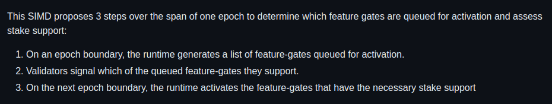

# Core Community Call 8 Notes

Meeting Date/Time: Friday, October 27th, 2023 19:00 UTC

Meeting Duration: 22 mins

[Video of the meeting](https://youtu.be/DOaQ_VBFyIw?si=l5e-_f9wEvQQiXyQ&t=1)

| Time  | Speaker  | Discussion                                    |
| ----- | -------- | --------------------------------------------- |
| 00:00 | Jacob    | Introduction                                  |
| 01:23 | Joe      | Introduction to SIMD Proposal                 |
| 03:35 | Joe      | Discussion on the activation process          |
| 06:11 | Liam     | Discussion on governance and compatibility    |
| 09:44 | Tyera    | Discussion on governance and compatibility    |
| 20:10 | Galactus | Discussion on Geyser Interface Implementation |

## Speakers:

1. [Jacob Creech](https://github.com/jacobcreech)
2. [Joe Caulfield](https://github.com/buffalojoec)
3. [Liam Heeger](https://www.linkedin.com/in/liamheeger/)
4. [Tyera Eulberg](https://www.linkedin.com/in/tyera-eulberg-275b225a/)
5. [Galactus | Mango Market](https://github.com/godmodegalactus)

### Introduction [00:00](https://youtu.be/DOaQ_VBFyIw?si=A7ysRRHXiO1clO-q)

**Jacob**: All right, welcome everyone to this month's core Community call. Today we will be having Joe present on I believe it's the feature gate threshold activation. Go ahead and take it away, Joe.

Joe: Cool, sounds good. Thanks, Jacob. Hey, guys, I'm Joe. For those of you who haven't met me, Yeah, I just wanted to talk a little bit about the [SIMD](https://github.com/solana-foundation/solana-improvement-documents/pull/72). If any of you guys haven't seen it, it's number 72. I'll try to share my screen I think, Jacob?

Jacob: Go for it.

## Discussion 1: Introduction to [SIMD](https://github.com/solana-foundation/solana-improvement-documents/pull/72) Proposal

**Joe**: Yeah. I'm not gonna go through every crazy nit-bit detail, but we can talk about the key points and stuff, whatever you guys kind of want to jam on. But basically, this is the proposal here. If someone could provide the [link](https://github.com/buffalojoec/solana-improvement-documents/blob/simd-feature-gate-threshold-automation/proposals/0072-feature-gate-threshold-automation.md), that'd be great. The whole idea is to basically create a process that is going to be like automated for kind of doing what we already have laid out with like the manual process for activating a feature. So like, right now, you would run like `solana feature activate`, and you're supposed to have like 95% of stake before you do that, right before like you try to activate a certain feature on a certain version. But it’s kind of up to you as like a person to go make sure, like a CLI will check for you. But you are supposed to make sure that that stake support is there.

VIDEO **[01:23](https://youtu.be/DOaQ_VBFyIw?si=A7ysRRHXiO1clO-q&t=83)**

So this process is going to kind of like automate that through the runtime and through a program. And basically the way it’s going to kind of work is if you go through this design [part](https://github.com/buffalojoec/solana-improvement-documents/blob/simd-feature-gate-threshold-automation/proposals/0072-feature-gate-threshold-automation.md#detailed-design) you can see like for example there’s two like nodes running different version, they have different feature sets and we want to make sure that only the feature sets that have majority like that 95% would be activated and this other ones would have to wait. So, again, 95% is the number that we have been going with for now and we can sort of discuss that later but that seems to be like what we want to stay with and in a nutshell this top like these three bullets here kind of summarize like

on an epoch boundary the runtime is going to generate a list of features gates that are queued, the validators are going to signal which of the queued features gates they support and then on the next epoch boundary the runtime will activate the ones that have the necessary support. And this is going to be an automated process, at least being proposed here. So, for starters, like we’ve been working a little bit to replace this feature 111 account, which actually doesn’t exist right now with a program because this is the owner of like all the feature accounts that we deploy when we go to activate so we want to swap that non-existent account for BPF program and that process may or may not take a SIMD, like we haven’t really I guess landed on that, part of it is in place right now but umm there’s some questions to answer about the program itself we can touch on later, but either way just imagine this program sits there. And then basically what it’s going to do is it’s going to use two PDAs through this proposal at least. One of them is going to sort of take the new request for activation as they come in and then at the end of the epic, it will take that list and it will finalize it, and that finalized list we’re going to call the queue is what the nodes will vote on in the following epoch. So, you’re going to have pretty much like two epochs of like process here. So, one to activate or queue to activate and then a second one to actually vote on for support and then that epoch boundary at the end there of epoch 2 is when you know the ones that have support will be activated.

VIDEO **[03:35](https://youtu.be/DOaQ_VBFyIw?si=A7ysRRHXiO1clO-q&t=215)**

**Joe**: So, What this kind of looks like is it’s going to be done through what’s called a bitmask. So, We'll have a bit-field for all the features that are sort of like, have been proposed. So, you’ll have this big bit-field and then well however big, right like we’ve talked a little bit about how what the size should be, and then every node will sort of signal a mask of that with a one for features they have and a zero for features they don't. And then, everybody will signal that, and at the end of the epoch, you'll take a look at all these signaled supports and just figure out who’s got the proper stake support and who doesn't. And just use, the bit-field to go ahead and activate only the proper ones, and kind of reset everything. So, that’s what this kind of talks about here.

This is what that would look like, there’s going to be an instruction that I should probably outline a little more that you would basically send this bit mask into the program it will store this information in PDAs so there’s one PDA for the **central authority bitmask** the bit field of the features that have been requested and then there’s each node will have a PDA of the ones that they support right and this will all kind of refresh every epoch.

And so just like the activation will still kind of work the same in a way there just be that check for the stake support, so this is like where things are a little bit dicey because it’s you know computationally intensive but or can be basically it will walk these accounts to tally up all the stake support and then only activate the ones that have the support. But once it knows who, like once we’ve tallied up who has the support um the rest is kind of like the same. Like it’ll run the activations that have been written into the code um so that’s like the proposal. There’s some alternatives I’ve included in here to.

## Discussion 2: Alternative Approaches

Like one alternative is we could sort of like not use two PDAs we could use just one, but that kind of makes things dicey with like the timing of when these signals go out and another you know alternative as well is we could not use transactions we can instead use the block header but there doesn’t seem to be like a ton of support for that idea. But um, I would love to sort of open up the conversation to just any thoughts on this. Especially considering like the multi client world we’re going to be in. Want to make sure that everybody has like a voice on this and we can kind of figure out what looks best for this. So, anybody um have any questions to start here.

**Joe**: Yeah, Liam go ahead.

VIDEO **[06:11](https://youtu.be/DOaQ_VBFyIw?si=A7ysRRHXiO1clO-q&t=371)**

**Liam**: Yeah, So, Hi, I'm from the Fire Dancer team. I’ve been looking at this, We’ve been thinking about this issue a lot. Because, as we build fire dancer, there’s a lot of features and there’s been like a lot of new features that have been added as we’ve been developing here and so um we’re intimately kind of involved in how features are being added and um having to track all of that. So when this proposal came up and it was not the first discussion that we’ve had about this, in fact we’ve been talking about this since probably day one, atleast internally. So, I guess like one of the big questions and I think like overall the proposal, like the bones of the proposal are or at least like the philosophy of this proposal is really good that like okay maybe like we should be enshrining how features get like activated based on like a stake weighted you know based on you know which you know which validators are actually running the feature based on their stake weight and then you know allowing them to be activated after that. I think that that’s actually a really good idea and it’s one that we had internally just didn’t think about how to do it. I think the big question like or I guess like there’s a few big questions and is and one of them was one that you just mentioned which was like iterating over all of the stake accounts at the end of an epoch to determine wheter a feature is ready for activation is kind of uh expensive well is an expensive operation um given the number of stake accounts that there are or even to iterate over the number of vote accounts that number could also end up exploding at some point. So, it’s just something to think about whether there should be one account maybe where these things are stored, where we do all the accumulation. I think there’s a comment about this too that we’ve been going back and forth about.

**Joe**: Year, I think you’re right. I think I saw that. So you think maybe use one account that everybody sort of appends to.

**Liam**: Maybe not appends to, but like there’s a counter in there for each individual feature. So like um I know this was kind of mentioned in in the comment that I made about like an alternative process and it’s certainly I think a worthwhile one is that instead of having this bit mask having each individual feature have it’s own account and um every time and have uh validators have to vote into each feature that uh is not active yet that they support and say like hey I’m good on this feature and they just increment one number in there and then once you reach like you know some percentage of the number of validators right or the number percent of the amount of stake uh that is necessary you know that feature is ready to be activated or is activatable.

**Joe**: So, would you suggest then they would write their stake in there then.

**Liam**: Uh, they have access to that right. I suppose. I think and then they could also

**Joe**: But the program. I think the problem is the program doesn't right, like, we have no way to prove that that's true right like from a program's context or is that wrong.

**Liam**: I can't remember if vote accounts actually contain the current actor State.

## Discussion 3: Governance and Compatibility

VIDEO **[09:44](https://youtu.be/DOaQ_VBFyIw?si=A7ysRRHXiO1clO-q&t=584)**

**Tyera**: I think the, sorry, Tiara here. The way that Richard wrote it out in Discord was using the leader schedule and so that is pullinable via SISVAR and then having bits that can reflect each slot in the leader schedule, and a validator could set the bits for their own leader slots. The concern that I have with that approach is that we now have a lot of contention on those single accounts. If we're concerned about scalability with the number of validators going up, now suddenly, you know, we have thousands of transactions all trying to hit those same accounts at the same time. What are your thoughts about that.

**Liam**: So one of the things there is like the idea there was that it's not a transaction like the leader implicitly is updating sisvars all the time, so this would just be another one of those that happens either before or after transaction processing. And so, it really.

**Tyera**: So, we have to come back to that same problem with timing in the epoch right, if if your leader slots are all at the very beginning, you can’t see much support later in the epoch.

**Liam**: But um, where but the I guess the issue is that that person also has a very small stake, they only get one um, they only get one set of slots uh in the leaders schedule, uh they’re probably like or even a handful they’re probably not a large like amount of the stake that’s currently active and so they probably don't constitute like the whole network as a whole is what matters here, in my mind. And they’re like If we're saying a threshold of 95%, well, 95% of stake is not going to just be hit all at the beginning of an epoch. That makes sense.

**Tyera**: Yeah, I think we might want to think that through, and, I don’t know, moc it out. Because I mean I think hypothetically you could have like 20,000 leader slots and they could all like because of the leader schedule is randomized they could all be at the start of the epoch and again you kind of have this problem where that whole rest of the epoch is wasted in terms of your support signalling.

**Liam**: That is, That is true. Yeah it’s something to think about I think. There’s there’s a trade-off between like having contention on an individual account or having or doing this process of having the leader take care of it during their control of the bank.

**Tyera**: And I think the, our thinking coming into this is that we are already doing those stake assessments on the epoch boundary. And it’s true that that might become a problem in a future where we have 100,000 nodes in the network. But it is a problem that we will already have to deal with.

**Liam**: Right.

I think, just a few other things that I have noted down here. I think there’s a lot of things that are done in this simd that are new. And I don’t want to be the person who like throws you know a wrench in in the process and it is mentioned that that the BPF like kind of this process of like enshrining a BPF program which has like you know some of these very specific properties, is a, it’s an important change to get right so that we could do it in the future. Because we’d love eventually to have all of the native programs be BPF too. And I think that’s an aspirational change that that um at least uh the people who are working on the new program runtime v2 are really excited about too. And so, it would be good to actually get a process down for that and have their input too so that we can kind of standardize this at the outset cuz like it’s not clear who should actually update uh these programs who should be responsible and um what kind of you know if they’re used very frequently maybe and they need like maybe some privileged access to uh things within the bank that aren’t normally available like we should probably think a little bit about those too, as well prior to this and then I think like I’m happy to write this up but like kind of a full road map of like how the feature roadmap or the the like feature gate stuff eventually turns into more of a governance-based approach as far as activation where the I think the big concern that I think serveral people that I’ve have spoken to on this have is that the just updating your software though may be an implicit, it’s an it’s a kind of implicit your you know consciously doing that it is not you are not kind of consenting to all these other new features that may effect you now maybe a validator you know may not be as profitable after some change just because of the software update which now triggers a feature activation right. So, it would be good to you know give the community that opportunity to come in and say, uh hey, actually you know before you know I like the software updates, because I get the security fixes but uh I don’t really want this other thing that kind of hurts me.

**Tyera**: Totally, Totally. um and I posted a comment in Discord just kind of at the 11th hour so you might not have had a chance to read it yet, but we Definitely Envision that being part of the process, and I think that we probably use some problematic language in the SIMD that suggests, like, I don't know if I hope the word 'vote' doesn't show up there, but it might. And then the word 'support' is probably also kind of problematic. Maybe we should have said something more like 'recognize' because this is the aspect that we're addressing in the SIMD is purely the, like, 'Hey, this feature exists in my validator software' aspect of it and isn't intended to replace an actual governance decision for queuing a future.

**Liam**: Yeah, I think we should make that really explicit. And then, as I said before, I think it's worth, and I'm happy to sit down and do it, but figuring out how that Lego piece plugs into a future governance system and making sure there's going to be compatibility with anything that wants to do. I don't think there's a lot to do there; it's more just that I think we should think about it so that it's not something we have to then re-architect the system for.

**Tyera**: Yeah, that sounds great.

If you are willing to start on a draft of that, I’m sure Joe and I, can both chime in and try to get something that seems solid. I don't know if this is an overarching organizational SIMD or where the best place for it is.

**Joe**: It kind of seems like governance is going to tie into this in multiple ways too because we've also touched on how we manage the program upgrades too, especially considering its elevated status, and that will also tie into, as you said, Liam, into the other programs that are going to become BPF eventually. So, there’s a lot of things to figure out.

**Liam**: Yeah, yeah, this SIMD, in a sense, kind of highlights some things that want to be done elsewhere too in many ways, like, and it would be really good to knock some of them out.

That's all I had.

**Tyera**: Thank you very much.

**Jacob**: There's also a few comments in the chat. Both on the, I think Zantetsu was talking about the governance discussions that have been going on and measuring based off of the epoch stakes, as well as I think GMGalactus from Mango is making some comments on the rewards distribution as well.

I guess, is this current SIMD requiring that SIMD or something similar so that you can measure what's on-chain, the stake distribution?

**Liam**: I think it's worth going back and looking.

Tyera Eulberg: I don't think that we have that requirement because the way we proposed it, the stake sort of tallies would be done in the runtime, which has direct access to the data.

**Jacob**: Okay.

**Tyera**: Rather then inside a BPF program. But, it's certainly worth considering, and as things develop, if we push more of the functionality into the program, that might change.

**Jacob**: Got it. Right. If there are any questions from the audience, feel free to raise your hand. Otherwise, we might be ending this early and continuing the discussion on Discord. Right. GM Galactus, I will get you on.

## Discussion 4: Geyser Interface Implementation

VIDEO [20:10](https://youtu.be/DOaQ_VBFyIw?si=LdkQgCvh1LmM2ZqJ&t=1210)

**Galactus**: Hey, thanks, Jacob. So actually, I just wanted another topic to discuss, another topic, and I want to know that if Fire Dancer is implementing Geyser interface, because we are looking into RPC architecture, like revised RPC architecture, which will stream all the data or Geyser.

**Liam**: Sorry, what was the original question? I was.

**Galactus**: Will Fire Dancer implement the Geyser interface or not?

**Liam**: I think we're happy to discuss it. There's not a specific plan yet, but it is certainly something that we would want internally as far as tooling goes.

**Josh Siegel**: We recognize that there is a need for a Geyser-like interface.

**Liam**: We will likely provide something that's not identical but is analogous.

**Galactus**: Okay, yeah. It makes sense. It makes sense.

**Yeah**. I also want to point out that there's not enough testing or Geyser, and we are thinking of strategies to test or in Solana Labs' client. So if anyone has some ideas, you can share.

**Jacob**: Also, make sure you ask in the Geyser channel on Solana Tech. GM Galactus so that we can continue the discussion there.

**Galactus**: Okay. Thanks.

All right. If there are no other questions, I think Zantetsu, you have a question about voting. I'm not quite sure if this is the place for that, but we can continue that in Discord. Otherwise, thank you, everyone, for coming to this month's Core Community call. Let's continue the discussion in Discord. Thank you, Jacob.

**Liam**: Thanks, everyone."

**Tyera**: Thanks everyone.

**Joe**: Thanks everyone.
